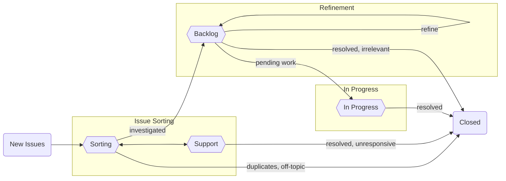

<!-- absolute URLs -->
[conda-org]: https://github.com/conda
[sub-team]: https://github.com/conda-incubator/governance#sub-teams

[project-planning]: https://github.com/orgs/conda/projects/2/views/11
[project-sorting]: https://github.com/orgs/conda/projects/2/views/11
[project-support]: https://github.com/orgs/conda/projects/2/views/12
[project-backlog]: https://github.com/orgs/conda/projects/2/views/13
[project-in-progress]: https://github.com/orgs/conda/projects/2/views/14

[docs-toc]: https://github.blog/changelog/2021-04-13-table-of-contents-support-in-markdown-files/
[docs-actions]: https://docs.github.com/en/actions
[docs-saved-reply]: https://docs.github.com/en/get-started/writing-on-github/working-with-saved-replies/creating-a-saved-reply
[docs-commit-signing]: https://docs.github.com/en/authentication/managing-commit-signature-verification/signing-commits

[infrastructure]: https://github.com/conda/infrastructure
[workflow-sync]: https://github.com/conda/infrastructure/blob/main/.github/workflows/sync.yml
[labels-global]: https://github.com/conda/infrastructure/blob/main/.github/global.yml

<!-- relative URLs -->
[workflow-cla]: /.github/workflows/cla.yml
[workflow-issues]: /.github/workflows/issues.yml
[workflow-labels]: /.github/workflows/labels.yml
[workflow-lock]: /.github/workflows/lock.yml
[workflow-project]: /.github/workflows/project.yml
[workflow-stale]: /.github/workflows/stale.yml
[labels-local]: /.github/labels.yml
[labels-page]: ../../labels

# How We Use GitHub

This document seeks to outline how we as a community use GitHub Issues to track bugs and feature requests while still catering to development practices & project management (_e.g._, release cycles, feature planning, priority sorting, etc.).

<!-- only include high-level topics or particularly noteworthy sections here -->
**Topics:**

  - [What is "Issue Sorting"?](#what-is-issue-sorting)
  - [Issue Sorting Procedures](#issue-sorting-procedures)
  - [Commit Signing](#commit-signing)
  - [Types of Issues](#types-of-issues)
    - [Standard Issue](#standard-issue)
    - [Epics](#epics)
    - [Spikes](#spikes)
  - [Working on Issues](#working-on-issues)

> **Note**
> This document is written in the style of an FAQ. For easier navigation, use [GitHub's table of contents feature][docs-toc].

## What is "Issue Sorting"?

> **Note**
> "Issue sorting" is similar to that of "triaging", but we've chosen to use different terminology because "triaging" is a word related to very weighty topics (_e.g._, injuries and war) and we would like to be sensitive to those connotations. Additionally, we are taking a more "fuzzy" approach to sorting (_e.g._, severities may not be assigned, etc.).

"Issue Sorting" refers to the process of assessing the priority of incoming issues. Below is a high-level diagram of the flow of issues:

### Why sort issues?

At the most basic "bird's eye view" level, sorted issues will fall into the category of four main priority levels:

- Do now
- Do sometime
- Provide user support
- Never do (_i.e._, close)

At its core, sorting enables new issues to be placed into these four categories, which helps to ensure that they will be processed at a velocity similar to or exceeding the rate at which new issues are coming in. One of the benefits of actively sorting issues is to avoid engineer burnout and to make necessary work sustainable; this is done by eliminating a never-ending backlog that has not been reviewed by any maintainers.

There will always be broad-scope design and architecture implementations that the maintainers will be interested in pursuing; by actively organizing issues, the sorting engineers will be able to more easily track and tackle both specific and big-picture goals.

### Who does the sorting?

Sorting engineers are a conda governance [sub-team][sub-team]; they are a group of community members who are responsible for making decisions regarding closing issues and setting feature work priorities, among other sorting-related tasks.

### How do items show up for sorting?

New issues that are opened in any of the repositories in the [conda GitHub organization][conda-org] will show up in the "Sorting" tab of the [Planning project][project-planning]. There are two [GitHub Actions][docs-actions] workflows utilized for this purpose; [`.github/workflows/issues.yml`][workflow-issues] and [`.github/workflows/project.yml`][workflow-project].

The GitHub Actions in the [`conda/infrastructure`][infrastructure] repository are viewed as canonical; the [`.github/workflows/sync.yml` workflow][workflow-sync] sends out any modifications to other `conda` repositories from there.

### What is done about the issues in the "Sorting" tab?

Issues in the ["Sorting" tab of the project board][project-sorting] are considered ready for the following procedures:

- Mitigation via short-term workarounds and fixes
- Redirection to the correct project
- Determining if support can be provided for errors and questions
- Closing out of any duplicate/off-topic issues

The sorting engineers on rotation are not seeking to _resolve_ issues that arise. Instead, the goal is to understand the issue and to determine whether it is legitimate, and then to collect as much relevant information as possible so that the maintainers can make an informed decision about the appropriate resolution schedule.

Issues will remain in the ["Sorting" tab][project-sorting] as long as the issue is in an investigatory phase (_e.g._, querying the user for more details, asking the user to attempt other workarounds, other debugging efforts, etc.) and are likely to remain in this state the longest, but should still be progressing over the course of 1-2 weeks.

For more information on the sorting process, see [Issue Sorting Procedures](#issue-sorting-procedures).

### When do items move out of the "Sorting" tab?

Items move out of the ["Sorting" tab][project-sorting] once the investigatory phase described in [What is done about the issues in the "Sorting" tab?](#what-is-done-about-the-issues-in-the-sorting-tab) has concluded and the sorting engineer has enough information to make a decision about the appropriate resolution schedule for the issue. The additional tabs in the project board that the issues can be moved to include the following:

- **"Support"** - Any issue in the ["Support" tab of the Planning board][project-support] is a request for support and is not a feature request or a bug report. Add the [`type::support`](https://github.com/conda/infrastructure/labels/type%3A%3Asupport) label to move an issue to this tab.
- **"Backlog"** - The issue has revealed a bug or feature request. We have collected enough details to understand the problem/request and to reproduce it on our own. These issues have been moved into the [Backlog tab of the Planning board][project-backlog] at the end of the sorting rotation during Refinement. Add the [`backlog`](https://github.com/conda/infrastructure/labels/backlog) label to move an issue to this tab.
- **"Closed"** - The issue was closed due to being a duplicate, being redirected to a different project, was a user error, a question that has been resolved, etc.

### Where do work issues go after being sorted?

Once issues are deemed ready to be worked on, they will be moved to the ["Backlog" tab of the Planning board][project-backlog]. Once actively in progress, the issues will be moved to the ["In Progress" tab of the Planning board][project-in-progress] and then closed out once the work is complete.

### What is the purpose of having a "Backlog"?

Issues are "backlogged" when they have been sorted but not yet earmarked for an upcoming release.

### What automation procedures are currently in place?

Global automation procedures synced out from the [`conda/infrastructure`][infrastructure] repo include:

- [Marking of issues and pull requests as stale][workflow-stale], resulting in:
  - issues marked as [`type::support`](https://github.com/conda/infrastructure/labels/type%3A%3Asupport) being labeled stale after 21 days of inactivity and being closed after 7 further days of inactivity (that is, closed after 30 inactive days total)
  - all other inactive issues (not labeled as [`type::support`](https://github.com/conda/infrastructure/labels/type%3A%3Asupport) being labeled stale after 365 days of inactivity and being closed after 30 further days of inactivity (that is, closed after an approximate total of 1 year and 1 month of inactivity)
  - all inactive pull requests being labeled stale after 365 days of inactivity and being closed after 30 further days of inactivity (that is, closed after an approximate total of 1 year and 1 month of inactivity)
- [Locking of closed issues and pull requests with no further activity][workflow-lock] after 365 days
- [Adding new issues and pull requests to the respective project boards][workflow-project]
- [Indicating an issue is ready for the sorting engineer's attention][workflow-issues] by toggling [`pending::feedback`](https://github.com/conda/infrastructure/labels/pending%3A%3Afeedback) with [`pending::support`](https://github.com/conda/infrastructure/labels/pending%3A%3Asupport) after a contributor leaves a comment
- [Verifying that contributors have signed the CLA][workflow-cla] before allowing pull requests to be merged; if the contributor hasn't signed the CLA previously, merging is be blocked until a manual review can be done
- [Syncing out templates, labels, workflows, and documentation][workflow-sync] from [`conda/infrastructure`][infrastructure] to the other repositories

## Issue Sorting Procedures

### How are issues sorted?

Issues in the ["Sorting" tab of the Planning board][project-sorting] are reviewed by issue sorting engineers, who take rotational sorting shifts. In the process of sorting issues, engineers label the issues and move them to the other tabs of the project board for further action.

Issues that require input from multiple members of the sorting team will be brought up during refinement meetings in order to understand how those particular issues fit into the short- and long-term roadmap. These meetings enable the sorting engineers to get together to collectively prioritize issues, earmark feature requests for specific future releases (versus a more open-ended backlog), tag issues as ideal for first-time contributors, as well as whether or not to close/reject specific feature requests.

### How does labeling work?

Labeling is a very important means for sorting engineers to keep track of the current state of an issue with regards to the asynchronous nature of communicating with users. Utilizing the proper labels helps to identify the severity of the issue as well as to quickly understand the current state of a discussion.

Each label has an associated description that clarifies how the label should be used. Hover on the label to see its description. Label colors are used to distinguish labels by category.

Generally speaking, labels with the same category are considered mutually exclusive, but in some cases labels sharing the same category can occur concurrently, as they indicate qualifiers as opposed to types. For example, we may have the following types, [`type::bug`](https://github.com/conda/infrastructure/labels/type%3A%3Abug), [`type::feature`](https://github.com/conda/infrastructure/labels/type%3A%3Afeature), and [`type::documentation`](https://github.com/conda/infrastructure/labels/type%3A%3Adocumentation), where for any one issue there would be _at most_ **one** of these to be defined (_i.e._ an issue should not be a bug _and_ a feature request at the same time). Alternatively, with issues involving specific operating systems (_i.e._, [`os::linux`](https://github.com/conda/infrastructure/labels/os%3A%3Alinux), [`os::macos`](https://github.com/conda/infrastructure/labels/os%3A%3Amacos), and [`os::windows`](https://github.com/conda/infrastructure/labels/os%3A%3Awindows)), an issue could be labeled with one or more, depending on the system(s) the issue occurs on.

Please note that there are also automation policies in place that are affected by labeling. For example, if an issue is labeled as [`type::support`](https://github.com/conda/infrastructure/labels/type%3A%3Asupport), that issue will be marked [`stale`](https://github.com/conda/infrastructure/labels/stale) after 21 days of inactivity and auto-closed after seven more days without activity (30 inactive days total), which is earlier than issues without this label. See [What automation procedures are currently in place?](#what-automation-procedures-are-currently-in-place) for more details.

### What labels are required for each issue?

At minimum, both `type` and `source` labels should be specified on each issue before moving it from the "Sorting" tab to the "Backlog" tab. All issues that are bugs should also be tagged with a `severity` label.

The `type` labels are exclusive of each other: each sorted issue should have exactly one `type` label. These labels give high-level information on the issue's classification (_e.g._, bug, feature, tech debt, etc.)

The `source` labels are exclusive of each other: each sorted issue should have exactly one `source` label. These labels give information on the sub-group to which the issue's author belongs (_e.g._, a partner, a frequent contributor, the wider community, etc.). Through these labels, maintainers gain insight into how well we're meeting the needs of various groups.

The `severity` labels are exclusive of each other and, while required for the [`type::bug`](https://github.com/conda/infrastructure/labels/type%3A%bug) label, they can also be applied to other types to indicate demand or need. These labels help us to prioritize our work. Severity is not the only factor for work prioritization, but it is an important consideration.

Please review the descriptions of the `type`, `source`, and `severity` labels on the [labels page][labels-page] prior to use.

### How are new labels defined?

Labels are defined using a scoped syntax with an optional high-level category (_e.g._, `source`, `tag`, `type`, etc.) and a specific topic, much like the following:

- `[topic]`
- `[category::topic]`
- `[category::topic-phrase]`

This syntax helps with issue sorting enforcement, as it helps to ensure that sorted issues are, at minimum, categorized by type and source.

There are a number of labels that have been defined for the different repositories. In order to create a streamlined sorting process, label terminologies are standardized using similar (if not the same) labels.

### How are new labels added?

New **global** labels (_i.e._, labels that apply equally to all repositories within the conda GitHub organization) are added to [`conda/infrastructure`][infrastructure]'s [`.github/global.yml` file][labels-global]; new **local** labels (_i.e._, labels specific to particular repositories) are added to each repository's [`.github/labels.yml` file][labels-local]. All new labels should follow the labeling syntax described in ["How are new labels defined?"](#how-are-new-labels-defined). Global labels are combined with any local labels and these aggregated labels are used by the [`.github/workflows/labels.yml` workflow][workflow-labels] to synchronize the labels available for the repository.

### Are there any templates to use as responses for commonly-seen issues?

Some of the same types of issues appear regularly (_e.g._, issues that are duplicates of others, issues that should be filed in the Anaconda issue tracker, errors that are due to a user's specific setup/environment, etc.).

Below are some boilerplate responses for the most commonly-seen issues to be sorted:

<b>Duplicate Issue</b>

<!-- this is a code block, any links need to be embedded -->
<pre>

This is a duplicate of <b>[link to primary issue]</b>; please feel free to continue the discussion there.
</pre>

> **Warning**
> Apply the https://github.com/conda/infrastructure/labels/duplicate label to the issue being closed and https://github.com/conda/infrastructure/labels/duplicate%3A%3Aprimary to the original issue.

<b>Requesting an Uninstall/Reinstall of <code>conda</code></b>

<!-- this is a code block, any links need to be embedded -->
<pre>

Please uninstall your current version of `conda` and reinstall the latest version.
Feel free to use either the [miniconda](https://docs.conda.io/en/latest/miniconda.html)
or [anaconda](https://www.anaconda.com/products/individual) installer,
whichever is more appropriate for your needs.
</pre>

<b>Redirect to Anaconda Issue Tracker</b>

<!-- this is a code block, any links need to be embedded -->
<pre>

Thank you for filing this issue! Unfortunately, this is off-topic for this repo.
If you are still encountering this issue please reopen in the
[Anaconda issue tracker](https://github.com/ContinuumIO/anaconda-issues/issues)
where `conda` installer/package issues are addressed.
</pre>

> **Warning**
> Apply the https://github.com/conda/infrastructure/labels/off-topic label to these issues before closing them out.

<b>Redirecting to Nucleus Forums</b>

<!-- this is a code block, any links need to be embedded -->
<pre>

Unfortunately, this issue is outside the scope of support we offer via GitHub;
if you continue to experience the problems described here,
please post details to the [Nucleus forums](https://community.anaconda.cloud/).
</pre>

> **Warning**
> Apply the https://github.com/conda/infrastructure/labels/off-topic label to these issues before closing them out.

<b>Slow solving of conda environment</b>

<!-- this is a code block, any links need to be embedded -->
<pre>
Hi [@username],

Thanks for voicing your concern about the performance of the classic dependency solver. To fix this, our official recommendation is using the new default "conda-libmamba-solver" instead of the classic solver (more information about the "conda-libmamba-solver" can be found here: https://conda.github.io/conda-libmamba-solver/getting-started/).

In most cases "conda-libmamba-solver" should be significantly faster than the "classic" solver. We hope it provides you with a much better experience going forward.
</pre>

In order to not have to manually type or copy/paste the above repeatedly, note that it's possible to add text for the most commonly-used responses via [GitHub's "Add Saved Reply" option][docs-saved-reply].

## Commit Signing

For all conda maintainers, we require commit signing and strongly recommend it for all others wishing to contribute to conda
related projects. More information about how to set this up within GitHub can be found here:

- [GitHub's signing commits docs][docs-commit-signing]

## Types of Issues

### Standard Issue

TODO

### Epics

TODO

### Spikes

#### What is a spike?

"Spike" is a term that is borrowed from extreme programming and agile development. They are used when the **outcome of an issue is unknown or even optional**. For example, when first coming across a problem that has not been solved before, a project may choose to either research the problem or create a prototype in order to better understand it.

Additionally, spikes represent work that **may or may not actually be completed or implemented**. An example of this are prototypes created to explore possible solutions. Not all prototypes are implemented and the purpose of creating a prototype is often to explore the problem space more. For research-oriented tasks, the end result of this research may be that a feature request simply is not viable at the moment and would result in putting a stop to that work.

Finally, spikes are usually **timeboxed**. However, given the open source/volunteer nature of our contributions, we do not enforce this for our contributors. When a timebox is set, this means that we are limiting how long we want someone to work on said spike. We do this to prevent contributors from falling into a rabbit hole they may never return from. Instead, we set a time limit to perform work on the spike and then have the assignee report back. If the tasks defined in the spike have not yet been completed, a decision is made on whether it makes sense to perform further work on the spike.

#### When do I create a spike?

A spike should be created when we do not have enough information to move forward with solving a problem. That simply means that, whenever we are dealing with unknowns or processes the project team has never encountered before, it may be useful for us to create a spike.

In day-to-day work, this kind of situation may appear when new bug reports or feature requests come in that deal with problems or technologies that the project team is unfamiliar with. All issues that the project team has sufficient knowledge of should instead proceed as regular issues.

#### When do I not create a spike?

Below are some common scenarios where creating a spike is not appropriate:

- Writing a technical specification for a feature we know how to implement
- Design work that would go into drafting how an API is going to look and function
- Any work that must be completed or is not optional

## Working on Issues

### How do I assign myself to an issue I am actively reviewing?

If you do **not** have permissions, please indicate that you are working on an issue by leaving a comment. Someone who has permissions will assign you to the issue. If two weeks have passed without a pull request or an additional comment requesting information, you may be removed from the issue and the issue reassigned.

If you are assigned to an issue but will not be able to continue work on it, please comment to indicate that you will no longer be working on it and press `unassign me` next to your username in the `Assignees` section of the issue page (top right).

If you **do** have permissions, please assign yourself to the issue by pressing `assign myself` under the `Assignees` section of the issue page (top right).
