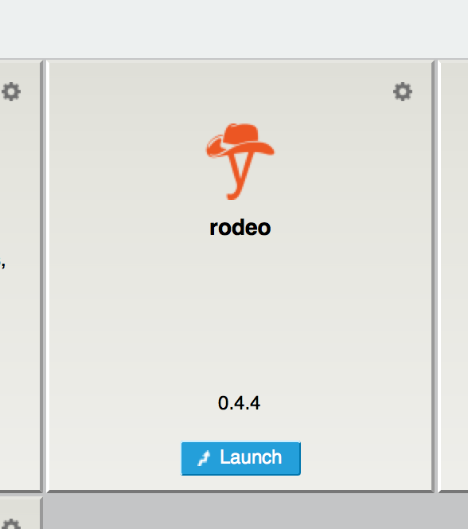

========================================
Building Anaconda Navigator Applications
========================================

Overview
--------

This tutorial will build an Anaconda Navigator Application (app)
of the `Rodeo IDE <https://www.yhat.com/products/rodeo>`_.

Who is this for?
----------------

This tutorial is for Windows, OS X, and Linux users who wish to generate an Anaconda Navigator app
conda package from a PyPI package. Prior knowledge of conda-build or conda recipes is recommended.

Conda build summary
~~~~~~~~~~~~~~~~~~~

The conda build recipe for Rodeo will be generated by conda skeleton. Three modifications
to the files in the build recipe are required to declare the package as an app. The package
is built and uploaded to your Anaconda Cloud channel. Finally, after adding the channel in
Anaconda Navigator the app will appear on the Home pane.

#. :ref:`before-you-start4`
#. :ref:`skeleton`
#. :ref:`requires`
#. :ref:`app-entry`
#. :ref:`build4`
#. :ref:`upload`
#. :ref:`navigator`
#. :ref:`troubleshooting4`
#. :ref:`help4`

.. _before-you-start4:

Before you start
----------------
Note: Applications to be built for Anaconda Navigator should have a graphical user interface.
Not all conda packages have graphical interfaces.

You should already have installed Miniconda_ or Anaconda_.

.. _Miniconda: http://conda.pydata.org/docs/install/quick.html
.. _Anaconda: https://docs.continuum.io/anaconda/install

Install conda-build:

.. code-block:: bash

    conda install conda-build

It is recommended that you use the latest versions of conda and conda-build. To upgrade both packages run:

.. code-block:: bash

    conda upgrade conda
    conda upgrade conda-build

You will also need an account on `Anaconda Cloud <https://anaconda.org>`_. Your username will be
referred to as your Anaconda Cloud channel.

.. _skeleton:

Create skeleton recipe
----------------------

First, in your user home directory, run the ``conda skeleton`` command:

.. code-block:: text

    conda skeleton pypi rodeo

This creates a directory named rodeo and creates three skeleton files in that directory: meta.yaml, build.sh,
and bld.bat. Use the ``ls`` command on OS X or Linux or the ``dir`` command on Windows to verify that these files
have been created.

.. _requires:

Modify Requirements
-------------------

In a text editor change entries from ``ipython`` to ``jupyter`` in the ``requirements`` section.
The full ``requirements`` section will look like this.

.. code-block:: yaml

    requirements:
      build:
        - python
        - setuptools
        - jupyter
        - flask >=0.10.1
        - docopt
        - pyzmq >=13
        - mistune

      run:
        - python
        - jupyter
        - flask >=0.10.1
        - docopt
        - pyzmq >=13
        - mistune

.. _app-entry:

App entry in meta.yaml
----------------------

To declare a conda package as an app the ``app`` parameter must be added to the ``meta.yaml`` file.
The ``app`` section will contain four keys ``entry``, ``icon``, ``summary`` and ``type``.

In the ``app`` section the ``entry`` tag defines how the package is to be launched by
Anaconda Navigator. For the Rodeo IDE separate ``entry`` tags are required for Windows, OS X,
and Linux operating systems.

In your text editor open the ``meta.yaml`` file and add the following lines.

On Windows and Linux the ``entry`` tag is

.. code-block:: yaml

    app:
      entry: rodeo .                              [win]
      entry: rodeo .                              [linux]

For OS X a launch script must also be provided.
In a text editor create a new file in the conda build recipe directory called ``rodeo_mac.command``.
The contents of this file are

.. code-block:: bash

    DIR=$(dirname $0)

    $DIR/rodeo ${HOME}

To make sure that the file gets installed add these lines to the ``build.sh`` script.

.. code-block:: bash

    if [ `uname` == Darwin ]
    then
        cp $RECIPE_DIR/rodeo_mac.command $PREFIX/bin
    fi

Then in ``meta.yaml`` add this line to the ``app`` section.

.. code-block:: yaml

      entry: open ${PREFIX}/bin/rodeo_mac.command [osx]

Finally, a logo PNG file is provided in the conda build recipe that will be displayed
in Anaconda Navigator. You can download the
`app.png file <https://github.com/yhat/rodeo/blob/master/resources/app.png>`_ directly
from the Github repository.
This file must be downloaded to the same directory as the ``meta.yaml`` file.

The completed ``app`` section should look like this.

.. code-block:: yaml

    app:
      entry: rodeo .                              [win]
      entry: rodeo .                              [linux]
      entry: open ${PREFIX}/bin/rodeo_mac.command [osx]
      icon: app.png
      summary: Rodeo Data Science IDE
      type: web

You can download full versions of the :download:`meta.yaml <rodeo/meta.yaml>` and :download:`build.sh <rodeo/build.sh>` files.

.. _build4:

Build
-----

Now that you have the conda build recipe ready, you can use the conda-build tool to create the package.
You will have to build and upload the rodeo package separately on Windows, OS X, and Linux machines in
order for the package to be available on all platforms.

.. code-block:: bash

    conda build rodeo

When conda-build is finished, it displays the exact path and filename of the conda package.
See the :ref:`troubleshooting` section if the conda-build command fails.

Windows example file path:

.. code-block:: text

    C:\Users\jsmith\Miniconda\conda-bld\win-64\rodeo-0.4.4-py35_0.tar.bz2

OS X example file path:

.. code-block:: text

    /Users/jsmith/miniconda/conda-bld/osx-64/rodeo-0.4.4-py35_0.tar.bz2

Linux example file path:

.. code-block:: text

    /home/jsmith/miniconda/conda-bld/linux-64/rodeo-0.4.4-py35_0.tar.bz2

NOTE: Your path and filename will vary depending on your installation and operating system. Save the
path and filename information for the next step.

.. _upload:

Upload to Anaconda Cloud
------------------------

Now you can upload the new local packages to Anaconda Cloud.

First login to Anaconda Cloud from your terminal application:

.. code-block:: text

    anaconda login

You will be asked for your Anaconda Cloud account name and password.
If the login was successful you will see output like the following.

.. code-block:: text

    Using Anaconda Cloud api site https://api.anaconda.org
    Username: defusco
    defusco's Password:
    login successful

Note: This step must be done in the root conda environment.

Now that you are logged into your channel you can upload the Rodeo conda package
as follows.

Windows users:

.. code-block:: text

    anaconda upload C:\Users\jsmith\Miniconda\conda-bld\win-64\rodeo-0.4.4-py35_0.tar.bz2

Linux and OS X users:

.. code-block:: text

    anaconda upload /home/jsmith/miniconda/conda-bld/linux-64/rodeo-0.4.4-py35_0.tar.bz2

Note: Change your path and filename to the exact path and filename you saved in Step 2. Your path and filename
will vary depending on your installation and operating system.

For more information about Anaconda Cloud, see the `Anaconda Cloud documentation page <http://docs.anaconda.org/>`_.

.. _navigator:

Configure Anaconda Navigator
----------------------------

Now that the Rodeo package has been uploaded to your Anaconda Cloud channel you
need to add the channel to Anaconda Navigator.

Launch the Anaconda Navigator app. In Windows and Linux it will be available
from the Start Menu. On OS X you can find it either on the Desktop
or through Spotlight.

Open the Environments pane on the far left:

.. image:: rodeo/navigator-home.png
    :scale: 50%

To add your channel first click the Channel button, second click the Add
button, third type in the URL to your Anaconda Cloud channel:

.. code-block:: text

    https://conda.anaconda.org/CHANNEL

Replace CHANNEL with your Anaconda Cloud username.

Finally, click the Update Channels button:

.. image:: rodeo/navigator-channel.png
    :scale: 50%

The last step is to close and restart Anaconda Navigator. The Rodeo app will be displayed on the Home pane.

.. _`troubleshooting4`:

Troubleshooting
---------------

A. Conda build fails
~~~~~~~~~~~~~~~~~~~~
If the conda recipe fails to build consult the :doc:`../troubleshooting` page.

B. App does not appear on the home pane
~~~~~~~~~~~~~~~~~~~~~~~~~~~~~~~~~~~~~~~
Check that the conda package has been uploaded to your Anaconda Cloud channel.

Check that your channel has been added to the Channels list.

You may have to remove your ``.anaconda/navigator`` directory and restart Navigator.

On Windows, OS X, and Linux this directory is in your Home directory.

C. App does not launch
~~~~~~~~~~~~~~~~~~~~~~
If after installing the application it does not launch check that it works
correctly on the command line with the following command.

.. code-block:: text

    conda run rodeo

If rodeo starts correctly then you may have to remove your ``.anaconda/navigator``
directory and restart Navigator.

On Windows, OS X, and Linux this directory is in your Home directory.

.. _`help4`:

Additional Information
----------------------
See the :doc:`../commands/build/conda-skeleton-pypi` reference page for more options.

For more information about adding Start Menu entries in Windows see the menuinst_ documentation.

.. _menuinst: https://github.com/ContinuumIO/menuinst/wiki
