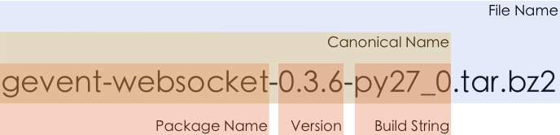

--------------------------
Package naming conventions
--------------------------

Names and versions of software packages do not follow any prescribed rules.
However, in order to facilitate communication and documentation,
conda employs the following naming conventions with respect to packages:

.. _package_name:
.. index::
    pair: terminology; package name
    seealso: name; package name

**package name**
    The name of a package, without any reference to a particular version.
    Conda package names are normalized, and may contain only lowercase alpha
    characters, numeric digits, underscores, or hyphens.  In usage
    documentation, these will be referred to by `package_name`.

.. _package_version:
.. index::
    pair: terminology; package version
    seealso: name; package version

**package version**
    A version number or string, often similar to *X.Y* or *X.Y.Z*, but may
    take other forms as well.

.. _build_string:
.. index::
    pair: terminology; build string
    seealso: name; build string

**build string**
    An arbitrary string that identifies a particular build of a package for
    conda.  It may contain suggestive mnemonics but these are subject to
    change and should not be relied upon or attempted to be parsed for any
    specific information.

.. _canonical_name:
.. index::
    pair: terminology; canonical name
    seealso: name; canonical name

**canonical name**
    The canonical name consists of the package name, version, and build
    string joined together by hyphens: *name*-*version*-*buildstring*.
    In usage documentation, these will be referred to by `canonical_name`.

.. _filename:
.. index::
    pair: terminology; filename

**file name**
    conda package filenames are canonical names, plus the suffix *.tar.bz2*.

These components are illustrated in the following figure:

   Different parts of conda package names.

.. _package_spec:
.. index::
    pair: terminology; package specification
    seealso: package spec; package specification

Additionally, a `package specification` is a package name, together with a package version (which may be partial or absent), joined by "=". Here are some examples:

* *python=2.7.3*
* *python=2.7*
* *python*

In usage documentation, these will be referred to by `package_spec`.
