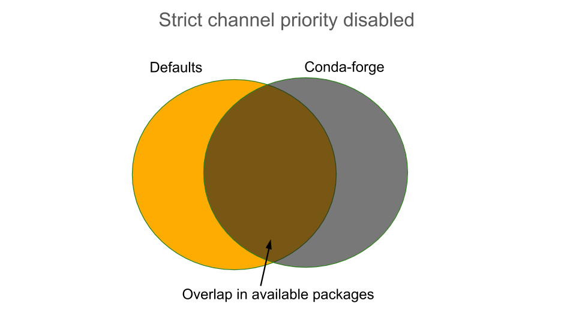
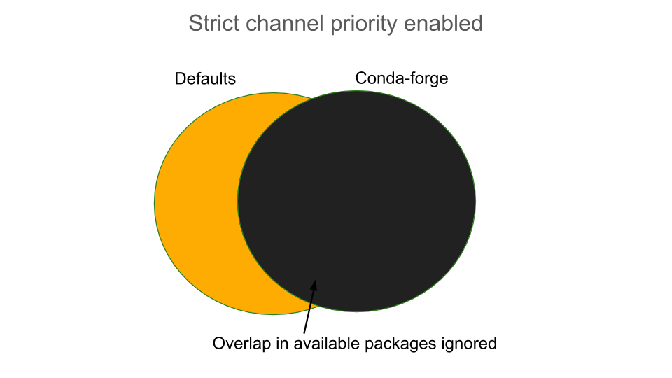

===========
Performance
===========

Conda's performance can be affected by a variety of things.
Unlike many package managers, Anaconda’s repositories generally
don’t filter or remove old packages from the index. This allows old
environments to be easily recreated. However, it does mean that the
index metadata is always growing, and thus conda becomes slower as the
number of packages increases.

How a package is installed
==========================

While you are waiting, conda is doing a lot of work installing the
packages. At any point along these steps, performance issues may arise.

Conda follows these steps when installing a package:

#. Downloading and processing index metadata.
#. Reducing the index.
#. Expressing the package data and constraints as a SAT problem.
#. Running the solver.
#. Downloading and extracting packages.
#. Verifying package contents.
#. Linking packages from package cache into environments.

Therefore, if you're experiencing a slowdown, evaluate the following questions
to identify potential causes:

* Are you creating a new environment or installing into an existing one?
* Does your environment have pip-installed dependencies in it?
* What channels are you using?
* What packages are you installing?
* Is the channel metadata sane?
* Are channels interacting in bad ways?

Improving conda performance
===========================

To address these challenges, you can move packages to archive
channels and follow the methods below to present conda with a smaller, simpler view than
all available packages.

To speed up conda, we offer the following recommendations.

Are you:
    * Using conda-forge?
        * Use conda-metachannel to reduce conda’s problem size.
    * Using bioconda?
        * Use conda-metachannel to reduce conda’s problem size.
        * `Read more about docker images <https://github.com/bioconda/bioconda-recipes/issues/13774>`_.
    * Specifying very broad package specs?
        * Be more specific. Letting conda filter more candidates makes it faster.
          For example, instead of ``numpy``, we recommend ``numpy=1.15`` or, even better, ``numpy=1.15.4``.
        * If you are using R, instead of specifying only ``r-essentials``, specify ``r-base=3.5 r-essentials``.
    * Feeling frustrated with “verifying transaction” and also feeling lucky?
        * Run ``conda config --set safety_checks disabled``.
    * Getting strange mixtures of defaults and conda-forge?
        * Run ``conda config --set channel_priority strict``.
        * This also makes things go faster by eliminating possible mixed solutions.
    * Observing that an Anaconda or Miniconda installation is getting slower over time?
        * Create a fresh environment. As environments grow, they become harder
          and harder to solve. Working with small, dedicated environments can
          be much faster.

Read more about `how we made conda faster <https://www.anaconda.com/how-we-made-conda-faster-4-7/>`_.

.. _concepts-performance-channel-priority:

Set strict channel priority
---------------------------

Setting strict channel priority makes it so that if a package exists on
a channel, conda will ignore all packages with the same name on lower
priority channels.

This can dramatically reduce package search space and reduces the use of
improperly constrained packages.

One thing to consider is that setting strict channel priority may make
environments unsatisfiable. Learn more about :ref:`strict`.

Reduce the index
----------------
One option for speeding up conda is to reduce the index. The index is
reduced by conda based upon the user's input specs. It's likely that
your repodata contains package data that is not used in the solving stage.
Filtering out these unnecessary packages before solving can save time.

Making your input specifications more specific improves
the effectiveness of the index reduction and, thus, speeds up the
process. Listing a version and build string for each of your specs can
dramatically reduce the number of packages that are considered when solving
so that the SAT doesn’t have as much work to do.

Reducing the index:
  * Reduces unnecessary input into generating solver clauses.
  * Reduces solve complexity.
  * Prefers newer packages that apply constraints.

Read more on `Understanding and Improving Conda's Performance
<https://www.anaconda.com/understanding-and-improving-condas-performance/>`_.
