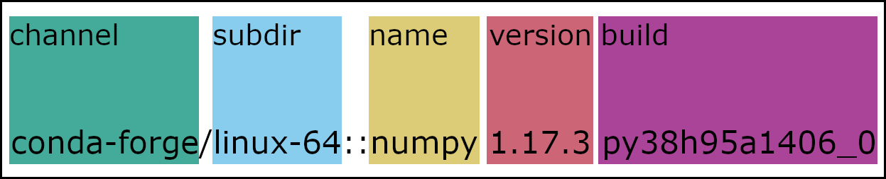

=========================================
Package search and install specifications
=========================================

Conda supports the following specifications for ``conda search`` and ``conda install``.

Package search
==============

``conda search`` for a specific package or set of packages can be accomplished in several ways. This section includes information on the standard specification and the use of key-value pairs.

Standard specification
----------------------

**channel**
    (Optional) Can either be a channel name or URL. Channel names may include letters, numbers, dashes, and underscores.

**subdir**
    (Optional) A subdirectory of a channel. Many subdirs are used for architectures, but this is not required. Must have a channel and backslash preceding it. For example: ``main/noarch``

**name**
    (Required) Package name. May include the ``*`` wildcard. For example, ``*py*`` returns all packages that have "py" in their names, such as "numpy", "pytorch", "python", etc.

**version**
    (Optional) Package version. May include the ``*`` wildcard or a version range(s) in single quotes. For example: ``numpy=1.17.*`` returns all numpy packages with a version containing "1.17." and ``numpy>1.17,<1.19.2`` returns all numpy packages with versions greater than 1.17 and less than 1.19.2.

**build**
    (Optional) Package build name. May include the ``*`` wildcard. For example, ``numpy 1.17.3 py38*`` returns all version 1.17.3 numpy packages with a build name that contains the text "py38".

Key-value pairs
---------------

Package searches can also be performed using what is called "key-value pair notation", which has different rules than the :ref:`Standard specification`
example image. The search below will return the same list of packages as the standard specification.

.. code-block:: none

   $ conda search "numpy[channel=conda-forge, subdir=linux-64, version=1.17.*, build=py38*]"

Key-value pair notation can be used at the same time as standard notation.

.. code-block:: none

   $ conda search "conda-forge::numpy=1.17.3[subdir=linux-64, build=py38*]"

.. warning::

   Any search values using the key-value pair notation will override values in the rest of the search string. For example, ``conda search numpy 1.17.3[version=1.19.2]`` will return packages with the version ``1.19.2``.

Package installation
====================

When you're installing packages, conda recommends being as concrete as possible. Using ``*`` wildcards and version ranges during an install will most likely cause a conflict.

However, ``*`` wildcards can still be helpful in an install command when used sparingly.

Installing with wildcards
-------------------------

Let's say you are working on a project that requires version 2.3 of a package. If you upgrade to 2.4 or 3.0, your project will break. You're also using an environment file to create your environment.

In the version ``2.3.1``, ``2`` is the major version, ``3`` is the minor version, and ``1`` is the patch. Patches typically contain bug fixes, so if you want to keep version ``2.3`` in your environment without updating to ``2.4`` or ``3.0``, but want to take advantage of any bug fixes, using ``2.3.*`` in your environment file would be helpful to you.

Concrete install example
------------------------

Let's take the search from the :ref:`Package search` section.

.. code-block:: none

   $ conda search "conda-forge/linux-64::numpy 1.17.* py38*"

This returns the following:

.. code-block:: none

   Loading channels: done
   # Name                       Version           Build  Channel
   numpy                         1.17.3  py38h95a1406_0  conda-forge
   numpy                         1.17.5  py38h18fd61f_1  conda-forge
   numpy                         1.17.5  py38h95a1406_0  conda-forge

You can then choose a specific version and build, if necessary, and edit your ``conda install`` command accordingly.

.. code-block:: none

   $ conda install "conda-forge/linux-64::numpy 1.17.5 py38h95a1406_0"
